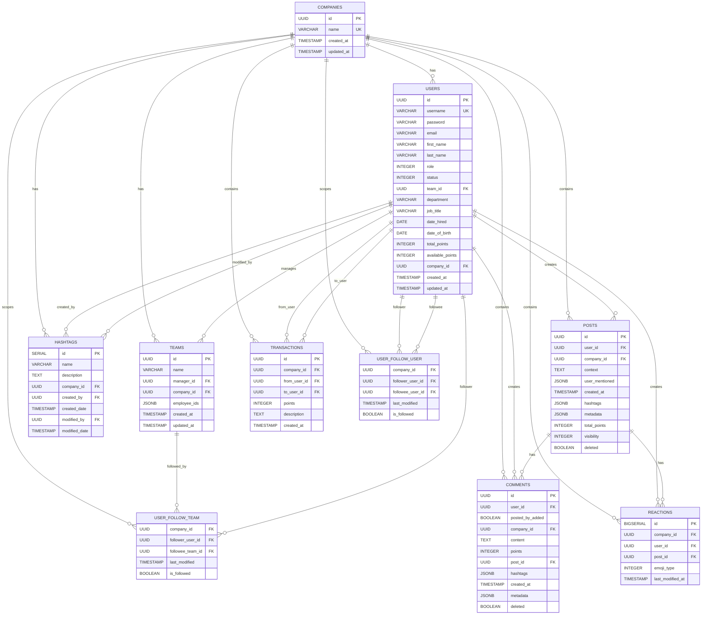
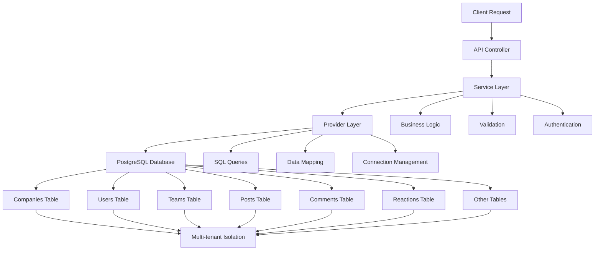
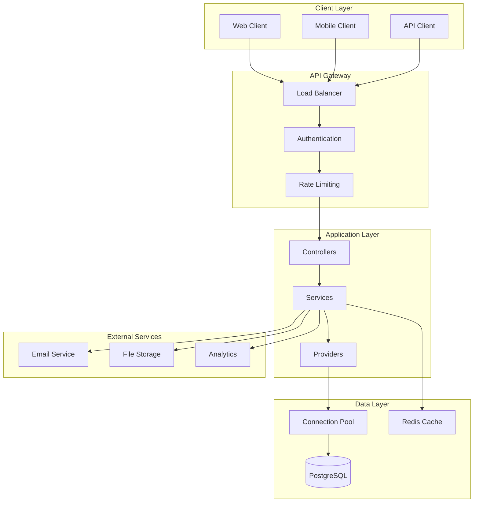
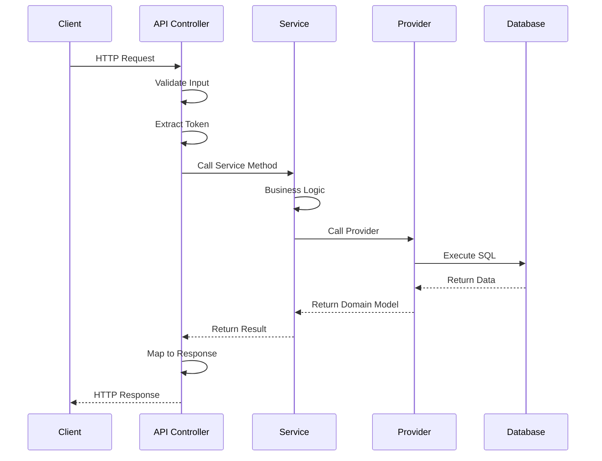
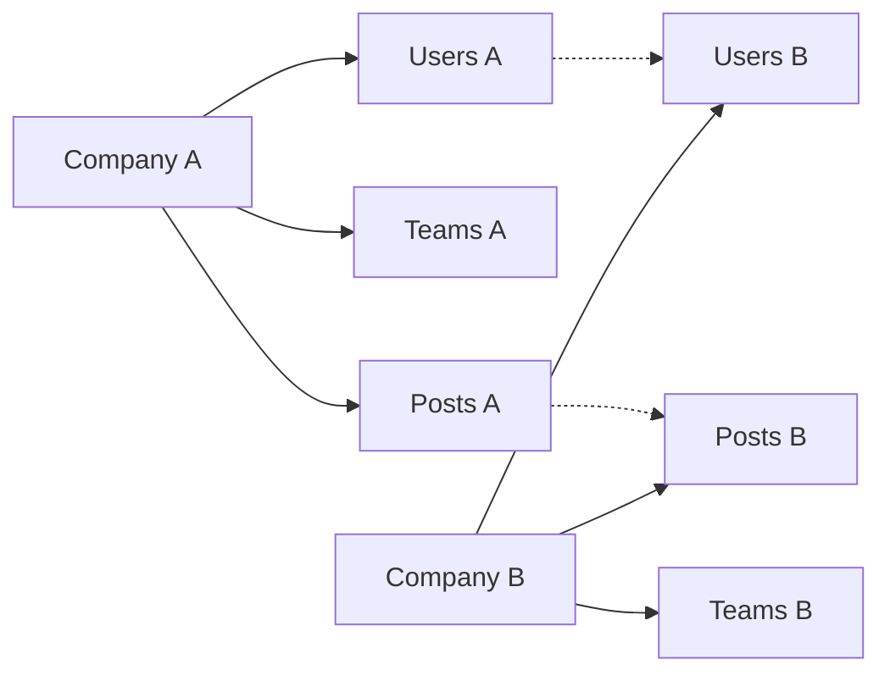
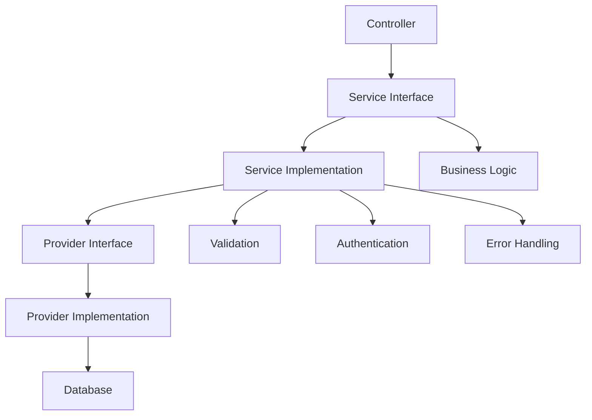
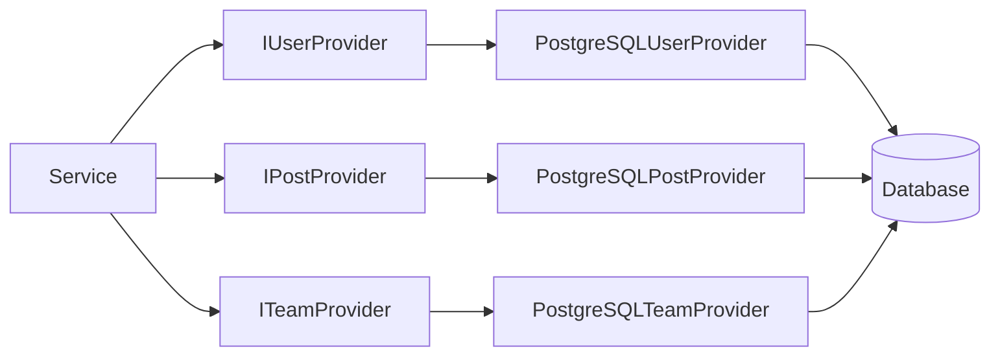
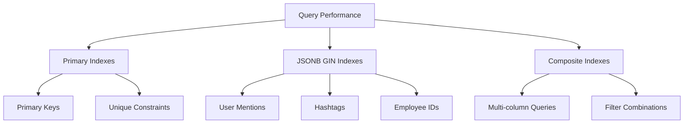
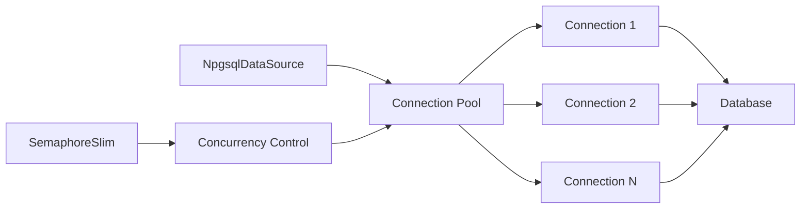

# Cherish Database Schema Diagram

## Entity Relationship Diagram

## Data Flow Diagram

## System Architecture Diagram

## API Request Flow

## Key Design Patterns

### 1. Multi-Tenancy Pattern

### 2. Service Layer Pattern

### 3. Repository Pattern

## Performance Optimization Strategies

### 1. Index Strategy

### 2. Connection Management

This comprehensive design provides a complete low-level view of the Cherish backend system, including database schema, relationships, API structure, and architectural patterns.
